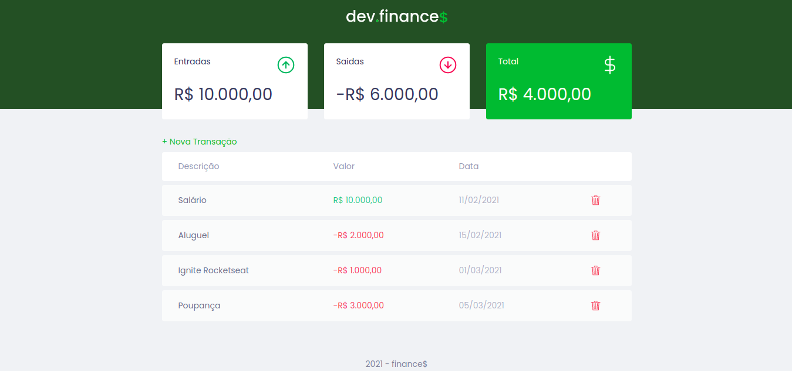

<h1 align="center">dev.finance💰</h1>

## 📝 Sobre
Aplicação financeira de entradas e saidas, desenvolvida na maratona Discover promovido pela [Rocketseat](https://www.rocketseat.com.br).

---

## 💻 Tecnologias
- HTML
- CSS
- JAVASCRIPT

---

### Autor

 
<b>Elves Brito</b>

---

## ©️ Licença
Esse projeto está sob a licença MIT. verifique a página **LICENCE** para mais detalhes.

